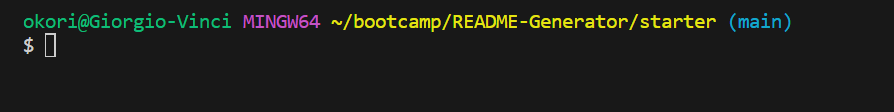
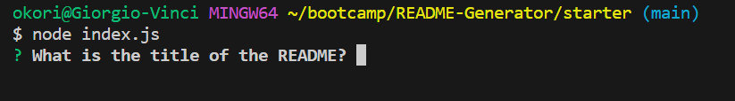

# README-Generator

## Description

This is a professional README generator that allows the user create a README file using the command line. It was done using a module in npm called Inquirer. Also file system in node was also used to write the file. With these tools I was able to create a professional README file which saves the user time as they can dynamically enter all the information they need without having to create a README file.

## Usage

To use this, the user should ensure the javasacript file has been opened in integrated terminal as seen below
md
    

Then type "node (name of javascript file).js" as shown below so the process of creating the README is initialised and the user gets to answer a few prompt questions.
md
    

    